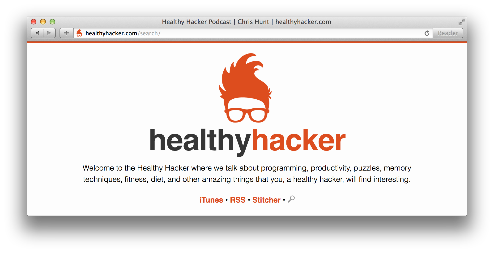

[](http://www.healthyhacker.com)

Dev server:

```
$ cd jekyll
$ bundle exec jekyll serve --host 0.0.0.0
```

Build it:

```
$ cd jekyll
$ rm -rf _site
$ wget -O feed.xml https://feeds.transistor.fm/healthy-hacker
$ bundle exec jekyll build
$ cp -rf _site/* ../
```
